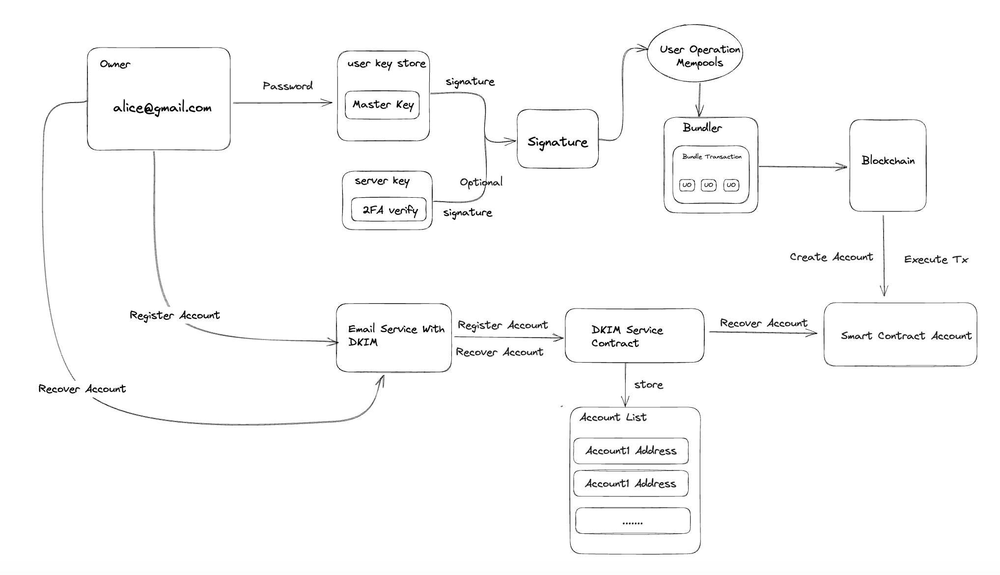

This branch is switched from [releases-v0.4](https://github.com/BaaS-Team/account-abstraction/tree/releases/v0.4).

Implementation of contracts for [ERC-4337](https://eips.ethereum.org/EIPS/eip-4337) account abstraction via alternative mempool.

# Features
Support for creating wallets using email. After the wallet device is lost, the wallet account can be securely recovered using the DKIM service contract through the email. As the DKIM service is deployed onto the contract, it becomes more decentralized and secure.

The architecture is as follows:

# Explanation
The main implementation contract for wallet accounts is [XBitWallet.sol](./contracts/samples/XBitWallet.sol), and the DKIM service contract is [DKIMService.sol](./contracts/core/DKIMService.sol). If you want to run tests, you can find the test files for the relevant contracts in the "test" directory.

# Resources

[Vitalik's post on account abstraction without Ethereum protocol changes](https://medium.com/infinitism/erc-4337-account-abstraction-without-ethereum-protocol-changes-d75c9d94dc4a)

[Discord server](http://discord.gg/fbDyENb6Y9)
